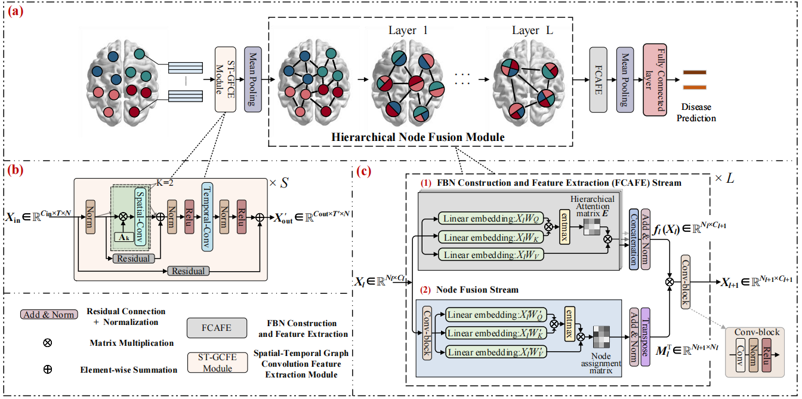

Constructing Hierarchical Attentive Functional Brain Networks for Early AD Diagnosis.

---
Overview
---

---
This code is for the paper: Constructing Hierarchical Attentive Functional Brain Networks for Early AD Diagnosis. 

Test
```
python  test.py 
```

---
Train

```
python  train.py 
```

---

Quick start

Before training the model, please configure the dependencies in the requirements.txt.

The example data and list of participants: https://drive.google.com/drive/folders/1gdNHBeaAhgbhm-RyUnAkH3zR2i7BfvJk?usp=sharing

Please note that the synthetic data are provided only to facilitate running the code and release of the original data used in the paper is out of the authority of the author. Please refer to the corresponding data resource for actual evaluation.
